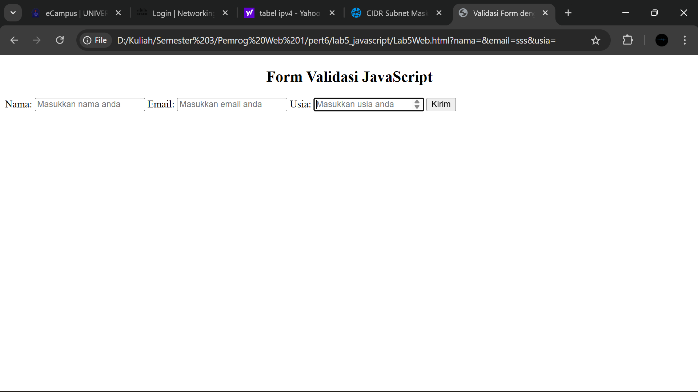

# Lab5Web


Nama : Bagus Sanjaya

Nim : 312410505

Kelas : TI.24.A.5

## Pertanyaan

1. Buat script untuk melakukan validasi pada isian form

## jawaban

1. Buat formnya terlebih dahulu, buat file `Lab5Web.html` dengan isi code ini

```
<!DOCTYPE html>
<html lang="id">
<head>
    <meta charset="UTF-8">
    <meta name="viewport" content="width=device-width, initial-scale=1.0">
    <title>Validasi Form dengan JavaScript</title>
</head>
<body>
    <h2 align="center">Form Validasi JavaScript</h2>
    <form name="formValidasi" onsubmit="return validasiForm()">
        <label>Nama:</label>
        <input type="text" name="nama" placeholder="Masukkan nama anda">
        
        <label>Email:</label>
        <input type="text" name="email" placeholder="Masukkan email anda">
        
        <label>Usia:</label>
        <input type="number" name="usia" placeholder="Masukkan usia anda">
        
        <button type="submit">Kirim</button>
    </form>

</body>
</html>
```



- Lalu buat script di body htmlnya agar menampilkan pesan "nama tidak boleh kosong!" jika user tidak mengisi kolom Nama.

- Menampilkan pesan "Email harus diisi!" jika user tidak mengisi kolom Email, dan menampilkan pesan "Format email tidak valid!" jika user tidak menggunakan (@).

- Menampilkan pesan "Usia wajib diisi!" jika user tidak mengisi kolom usia, dan menampilkan pesan "Usia minimal 17 tahun!" jika user mengisi kolom dengan umur dibawah 17.

- Menampilkan pesan "Form berhasil dikirim!" jika semua sudah terpenuhi dan dikirim.

```
<script>
    function validasiForm() {
        var nama = document.forms["formValidasi"]["nama"].value;
        var email = document.forms["formValidasi"]["email"].value;
        var usia = document.forms["formValidasi"]["usia"].value;

        if (nama == "") {
            alert("Nama tidak boleh kosong!");
            document.forms["formValidasi"]["nama"].focus();
            return false;
        }

        if (email == "") {
            alert("Email harus diisi!");
            document.forms["formValidasi"]["email"].focus();
            return false;
        } else if (email.indexOf("@") == -1 || email.indexOf(".") == -1) {
            alert("Format email tidak valid!");
            document.forms["formValidasi"]["email"].focus();
            return false;
        }

        if (usia == "") {
            alert("Usia wajib diisi!");
            document.forms["formValidasi"]["usia"].focus();
            return false;
        } else if (usia < 17) {
            alert("Usia minimal 17 tahun!");
            document.forms["formValidasi"]["usia"].focus();
            return false;
        }

        alert("Form berhasil dikirim!");
        return true;
    }
</script>
```


- Kemudian tambahkan cssnya

```
<style>
    body {
        font-family: Arial, sans-serif;
        background-color: #f0f0f0;
        padding: 30px;
    }
    form {
        background-color: #fff;
        padding: 20px;
        border-radius: 10px;
        width: 350px;
        margin: auto;
        box-shadow: 0 0 8px rgba(0,0,0,0.2);
    }
    label {
        font-weight: bold;
    }
    input {
        width: 100%;
        padding: 8px;
        margin-top: 5px;
        margin-bottom: 15px;
        border-radius: 5px;
        border: 1px solid #ccc;
    }
    button {
        background-color: #4CAF50;
        color: white;
        border: none;
        padding: 10px;
        border-radius: 5px;
        cursor: pointer;
        width: 100%;
    }
    button:hover {
        background-color: #45a049;
    }
</style>
```


